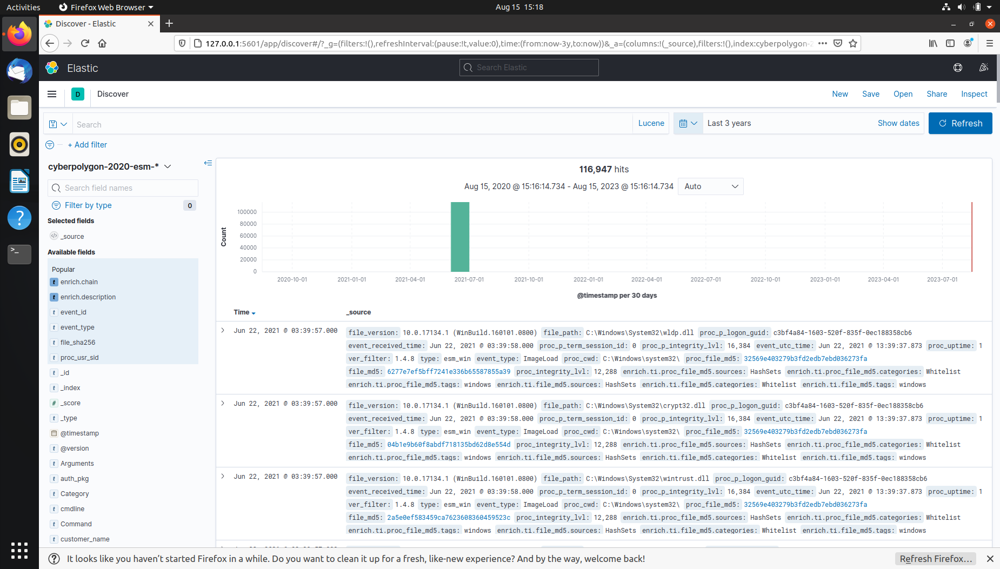

# CyberCorp Case 2

The [CyberCorp Case 2 challenge](https://cyberdefenders.org/blueteam-ctf-challenges/75) was created by [Vadim Khrykov and his team](https://www.linkedin.com/in/vadim-khrykov-39a227102/), and is based on a real-world attack. 

## Scenario

After a cybersecurity incident, CyberCorp's management decided to purchase and deploy EDR (Endpoint Detection and Response) solution. EDR agents were installed on all workstations and servers and forwarded telemetry to a centralized Threat Hunting platform.

The company has also hired a security blue team of highly qualified analysts to build a threat detection process using the Threat Hunting approach. You will have to try on the role of a threat hunter, who decided to verify the hypothesis about one of the attacker's persistence techniques.

Unfortunately, the hypothesis was confirmed, and a persistence technique was discovered on one host, which eventually became the starting point of the investigation.

By analyzing the EDR telemetry in the Threat Hunting platform, you will have to understand how the attacker compromised the network and what he managed to do with the obtained access.

## Resources

* [Threat Hunting. Why might you need it](https://cyberpolygon.com/materials/threat-hunting-why-might-you-need-it/)
* [Threat Hunting in action](https://cyberpolygon.com/materials/threat-hunting-in-action/)
* [Hunting for advanced Tactics, Techniques and Procedures (TTPs)](https://cyberpolygon.com/materials/hunting-for-advanced-tactics-techniques-and-procedures-ttps/)

## Tools

* [Kibana](https://www.elastic.co/kibana/)

## Setting up

* Download the VM, [watch the vid](https://www.youtube.com/watch?v=PczISJGPvKg), import, change network settings, start the VM.
* Open Firefox, and click on the Kibana bookmark.
* Update time range for last 3 years to see when the logs start.

## Questions

***Q1 The Threat Hunting process usually starts with the analyst making a hypothesis about a possible compromise vector or techniques used by an attacker. In this scenario, your initial hypothesis is as follows: "The attacker used the WMI subscription mechanism to obtain persistence within the infrastructure". Verify this hypothesis and find the name of the WMI Event Consumer used by the attacker to maintain his foothold. Sample answer: Consumer***

***Q2 In the previous step, you looked for traces of the attacker's persistence in the compromised system through a WMI subscription mechanism. Now find the process that installed the WMI subscription. Answer the question by specifying the PID of that process and the name of its executable file, separated by a comma without spaces. Sample answer: 1200,program.exe.***

***Q3 "The process described in the previous question was used to open a file extracted from the archive that user received by email. Specify a SHA256 hash of the file extracted and opened from the archive. Sample answer: e3b0c44298fc1c149afbf4c8996fb92427ae41e4649b934ca495991b7852b855"***

***Q4 The file mentioned in question 3, is not malicious in and of itself, but when it is opened, another file is downloaded from the Internet that already contains the malicious code. Answer the question by specifying the address, from which this file was downloaded, and the SHA256 hash of the downloaded file, separated by commas without spaces. Sample answer: 192.168.0.1,e3b0c44298fc1c149afbf4c8996fb92427ae41e4649b934ca495991b7852b855***

***Q5 The malicious code from the file, mentioned in question 4, directly installed a WMI subscription, which we started our hunting with, and also downloaded several files from the Internet to the compromised host. For file downloading, the attacker used a tricky technique that gave him the opportunity to hide the real process, which initiated the corresponding network activity. Specify the SHA256 hash of the operating system component whose functionality was used by the attacker to download files from the Internet. Sample answer: e3b0c44298fc1c149afbf4c8996fb92427ae41e4649b934ca495991b7852b855***

***Q6 Specify the domain name of the resource from which the files mentioned in question 5 were supposedly downloaded as a result of malicious code execution. Sample answer: sub.domain.com***

***Q7 The first file downloaded (as a result of executing the code in question 5) contained encoded executable code (PE), which after downloading was recorded in the registry. Specify an MD5 hash of the original representation of that code (PE). Sample answer: d41d8cd98f00b204e9800998ecf8427e***

***Q8 The second file downloaded (as a result of code execution, which we talked about in question 5) was a script, that was set up to autostart via WMI Subscription. Specify the SHA256 hash of this script. Sample answer: e3b0c44298fc1c149afbf4c8996fb92427ae41e4649b934ca495991b7852b855***

***Q9 The script, mentioned in question 8, spawned one of the legitimate system processes and injected into its memory a malicious code that was read and decoded from the registry (this code was mentioned in question 7). This malicious code migrated through a chain of code injections to the address space of another legitimate process, where it continued to run without further migration.***

***For this answer, provide the next data, separated by a comma without spaces:***
* ***PID of the initial legitimate system process, which was spawned by the script and where this script launched in-memory execution of malicious code;***
* ***PID of the target process, to which malicious code migrated from the initial process and in the context of which attacker performed different post-exploitation activity Sample answer: 1234,9876***

***Q10 The malicious code run by the script is a Reverse Shell. Identify the IP address and port number of its command center. Sample answer: 192.168.0.1:123***

***Q11 As a result of running a malicious code, which we talk about in questions 9 and 10, the attacker got a shell on the compromised host. Using this access, the attacker downloaded the Active Directory collection utility to the host in an encoded form. Specify a comma-separated, non-spaced link where the encoded version of the utility was downloaded and a SHA256 hash of the decoded version that was directly run by the attacker on the compromised host. Sample answer: http://domain.com/file,e3b0c44298fc1c149afbf4c8996fb92427ae41e4649b934ca495991b7852b855***

***Q12 During the post-exploitation process, the attacker used one of the standard Windows utilities to create a memory dump of a sensitive system process that contains credentials of active users in the system. Specify the name of the executable file of the utility used and the name of the memory dump file created, separated by a comma without spaces. Sample answer: program.exe,file.ext***

***Q13 Presumably, the attacker extracted the password of one of the privileged accounts from the memory dump we discussed in the previous question and used it to run a malicious code on one of the domain controllers. What account are we talking about? Specify its username and password as the answer in login:password format. Sample answer: kate:qwerty***

***Q14 A compromised user account is a member of two Built-in privileged groups on the Domain Controller. The first group is the Administrators. Find the second group. Provide the SID of this group as an answer. Sample answer: S-1-5-32-545***

***Q15 As a result of malicious code execution on the domain controller using a compromised account, the attacker got a reverse shell on that host. This shell used a previously not seen IP address as the command center. Specify its address as the answer. Sample answer: 192.168.0.1***
