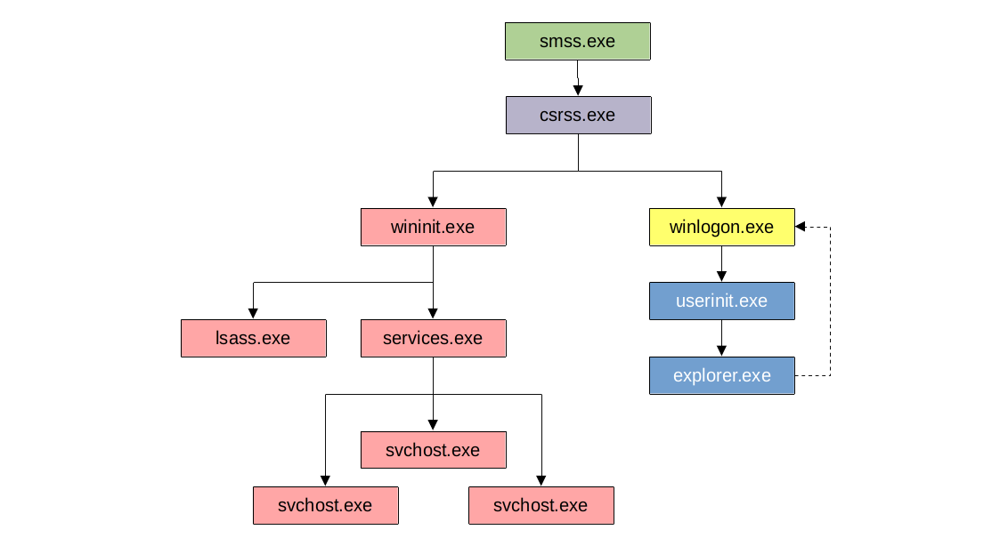

# Introduction

## What?

Exploring the core processes within a Windows OS and understand what normal behaviour is.

## Why?

This foundational knowledge will help identify malicious processes running on an endpoint.

## How?

* [smss.exe](smss.md)
* [csrss.exe](csrss.md)
* [wininit.exe](wininit.md)
* [services.exe](services.md)
* [svchost.exe](svchost.md)
* [lsass.exe](lsass.md)
* [winlogon.exe](winlogon.md)
* [explorer.exe](explorer.md)
