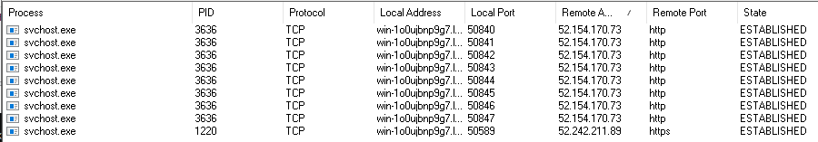

# Networking utilities

## TCPView

"[TCPView](https://learn.microsoft.com/en-us/sysinternals/downloads/tcpview) is a Windows program that will show 
detailed listings of all TCP and UDP endpoints on your system, including 
the local and remote addresses and state of TCP connections. On Windows Server 2008, Vista, and XP, TCPView also 
reports the name of the process that owns the endpoint. TCPView provides a more informative and conveniently 
presented subset of the Netstat program that ships with Windows. The TCPView download includes `Tcpvcon`, a 
command-line version with the same functionality." (official definition)

Windows has a built-in utility that provides the same functionality. This tool is called Resource Monitor. There 
are many ways to open this tool. From the command line use `resmon`.

### Question

Using WHOIS tools, what is the ISP/Organization for the remote address in the screenshot? 

| 
|:--:|
| With Listen unselected in the Connection States from the States Filter and  UDP v4 and UDP v6 turned off from the top toolbar. |

    whois 52.154.170.73

    ...
    NetRange:       52.145.0.0 - 52.191.255.255
    CIDR:           52.148.0.0/14, 52.160.0.0/11, 52.152.0.0/13, 52.146.0.0/15, 52.145.0.0/16
    NetName:        MSFT
    NetHandle:      NET-52-145-0-0-1
    Parent:         NET52 (NET-52-0-0-0-0)
    NetType:        Direct Allocation
    OriginAS:       
    Organization:   Microsoft Corporation (MSFT)
    RegDate:        2015-11-24
    Updated:        2021-12-14
    Ref:            https://rdap.arin.net/registry/ip/52.145.0.0
    ...

Answer: Microsoft Corporation

