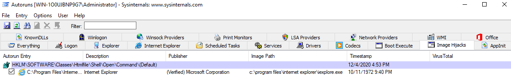

# Process utilities

## Autoruns

"This utility, which has the most comprehensive knowledge of auto-starting locations of any startup monitor, shows 
you what programs are configured to run during system bootup or login, and when you start various built-in Windows 
applications like Internet Explorer, Explorer and media players. These programs and drivers include ones in your 
startup folder, Run, RunOnce, and other Registry keys. Autoruns reports Explorer shell extensions, toolbars, browser 
helper objects, Winlogon notifications, auto-start services, and much more. Autoruns goes way beyond other autostart 
utilities." (official definition)

This is a good tool to search for any malicious entries created in the local machine to establish Persistence.

## ProcDump

"[ProcDump](https://docs.microsoft.com/en-us/sysinternals/downloads/procdump) is a command-line utility whose primary 
purpose is monitoring an application for CPU spikes and generating crash dumps during a spike that an administrator 
or developer can use to determine the cause of the spike." (official definition) 

## Process Explorer

"The Process Explorer display consists of two sub-windows. The top window always shows a list of the currently active processes, including the names of their owning accounts, whereas the information displayed in the bottom window depends on the mode that Process Explorer is in: if it is in handle mode you'll see the handles that the process selected in the top window has opened; if Process Explorer is in DLL mode you'll see the DLLs and memory-mapped files that the process has loaded." (official definition) 

There is an option within ProcExp to Verify Signatures. Once enabled, it shows up as a column within the Process view. 
Other options to note include Run at Logon and Replace Task Manager.

## Process Monitor

"Process Monitor is an advanced monitoring tool for Windows that shows real-time file system, Registry and 
process/thread activity. It combines the features of two legacy Sysinternals utilities, Filemon and Regmon, and adds 
an extensive list of enhancements including rich and non-destructive filtering, comprehensive event properties 
such as session IDs and usernames, reliable process information, full thread stacks with integrated symbol support 
for each operation, simultaneous logging to a file, and much more. Its uniquely powerful features will make 
Process Monitor a core utility in your system troubleshooting and malware hunting toolkit." (official definition) 

[The Ultimate Guide to Procmon ->](https://adamtheautomator.com/procmon/)

## PsExec

"PsExec is a light-weight telnet-replacement that lets you execute processes on other systems, complete with full 
interactivity for console applications, without having to manually install client software. PsExec's most powerful 
uses include launching interactive command-prompts on remote systems and remote-enabling tools like IpConfig that 
otherwise do not have the ability to show information about remote systems." (official definition)

PsExec is another tool that is utilized by adversaries. This tool is associated with MITRE techniques 
[T1570 (Lateral Tool Transfer)](https://attack.mitre.org/techniques/T1570), 
[T1021.002 (Remote Services: SMB/Windows Admin Shares)](https://attack.mitre.org/techniques/T1021/002), and 
[T1569.002 (System Services: Service Execution)](https://attack.mitre.org/techniques/T1569/002) in 
[MITRE ID S0029](https://attack.mitre.org/software/S0029/).

[Everything You Wanted to know About Psexec ->](https://adamtheautomator.com/psexec/)

## Questions

Run Autoruns and inspect what are the new entries in the Image Hijacks tab compared to the screenshot earlier.

| 
|:--:|
| Earlier |

| 
|:--:|
| Now |

What entry was updated?

Answer: `taskmgr.exe`

What is the updated value?

Answer: `c:\tools\sysint\procexp.exe`
