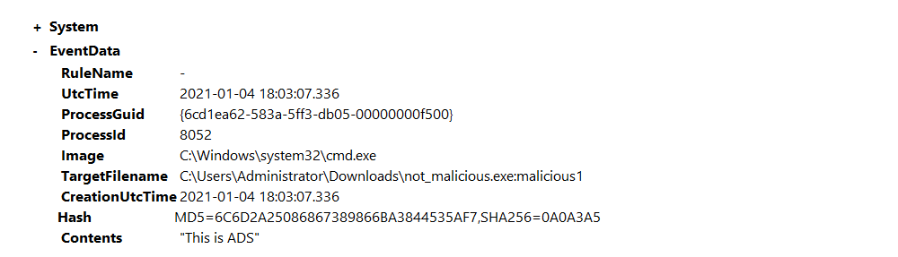
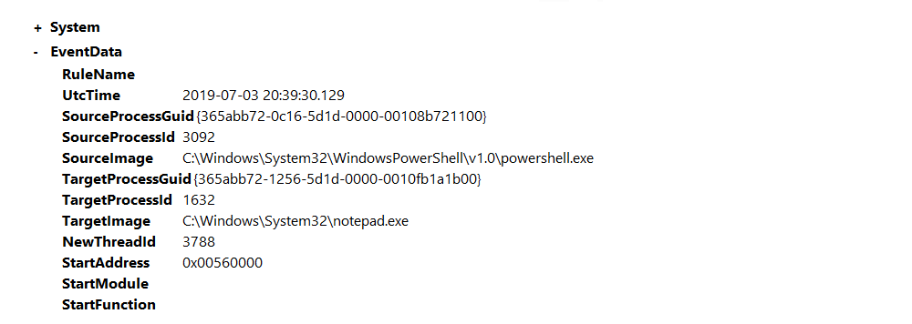

# Detecting evasion techniques

There are a number of evasion techniques used by malware authors to evade both antivirus and detections. Some 
examples of evasion techniques are Alternate Data Streams, Injections, Masquerading, Packing/Compression, 
Recompiling, Obfuscation, and Anti-Reversing Techniques. 

Alternate Data Streams are used by malware to hide its files from normal inspection by saving the file in a 
different stream apart from `$DATA`. Sysmon comes with an event ID to detect newly created and accessed streams 
allowing us to quickly detect and hunt malware that uses ADS. 

Injection techniques come in different types: Thread Hijacking, PE Injection, DLL Injection, and more. Here, the focus 
is on DLL Injection and back-dooring DLLs. This is done by taking an already used DLL that is used by an application 
and overwriting or including the malicious code within the DLL.

## Alternate Data Streams config

The first technique we will be looking at is hiding files using alternate data streams using Event ID 15. Event ID 15 will hash and log any NTFS Streams that are included within the Sysmon configuration file. This will allow us to hunt for malware that evades detections using ADS. To aid in hunting ADS we will be using the SwiftOnSecurity Sysmon configuration file. The code snippet below will hunt for files in the Temp and Startup folder as well as .hta and .bat extension.

    <RuleGroup name="" groupRelation="or">
        <FileCreateStreamHash onmatch="include">
            <TargetFilename condition="contains">Downloads</TargetFilename>
            <TargetFilename condition="contains">Temp\7z</TargetFilename>
            <TargetFilename condition="ends with">.hta</TargetFilename>
            <TargetFilename condition="ends with">.bat</TargetFilename>
        </FileCreateStreamHash>
    </RuleGroup>

## Basic ADS

Open `C:\Users\THM-Analyst\Desktop\Scenarios\Practice\Hunting_ADS.evtx` in Event Viewer to view hidden files using 
an alternate data stream.

| 
|:--:|
| The event shows the location of the file name as well as the contents of the file. |

Listing Data Streams:

    C:\\Users\\THM-Threat>dir /r

## Remote Threads config

Adversaries also commonly use remote threads to evade detections in combination with other techniques. Remote 
threads are created using the Windows API `CreateRemoteThread` and can be accessed using `OpenThread` and 
`ResumeThread`. This is used in multiple evasion techniques including DLL Injection, Thread Hijacking, and Process 
Hollowing. Use the Sysmon event `ID 8` from the `SwiftOnSecurity` configuration file. The code snippet excludes 
common remote threads without including any specific attributes. This allows for a more open and precise event rule. 

    <RuleGroup name="" groupRelation="or">
        <CreateRemoteThread onmatch="exclude">
            <SourceImage condition="is">C:\Windows\system32\svchost.exe</SourceImage>
            <TargetImage condition="is">C:\Program Files (x86)\Google\Chrome\Application\chrome.exe</TargetImage>
        </CreateRemoteThread>
    </RuleGroup>

## Process hollowing notepad.exe

Open `C:\Users\THM-Analyst\Desktop\Scenarios\Practice\Detecting_RemoteThreads.evtx` in Event Viewer to observe a 
Process Hollowing attack that abuses the notepad.exe process.

| 
|:--:|
| The event shows `powershell.exe` creating a remote thread and accessing `notepad.exe`. |

## Detecting evasion techniques with PowerShell

Detecting remote thread creation:

    Get-WinEvent -Path <Path to Log> -FilterXPath '*/System/EventID=8'

## Resources

* [MITRE ATT&CK T1564](https://attack.mitre.org/techniques/T1564/)
* [MITRE ATT&CK T1055](https://attack.mitre.org/techniques/T1055/)
