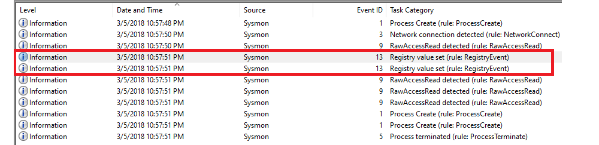
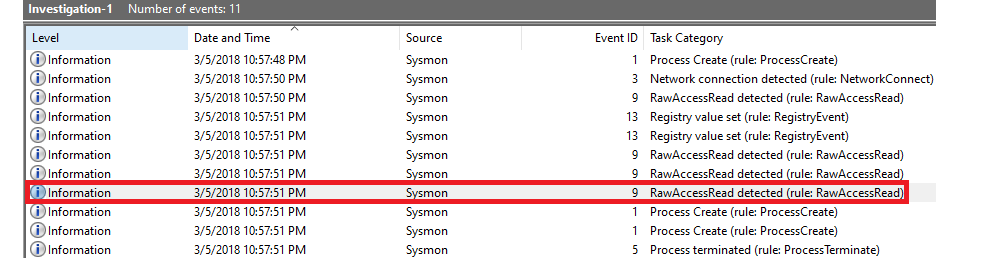
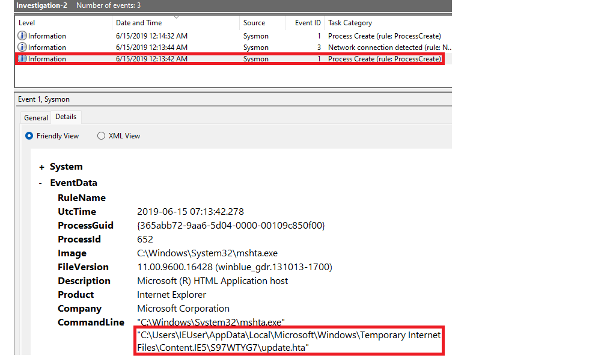
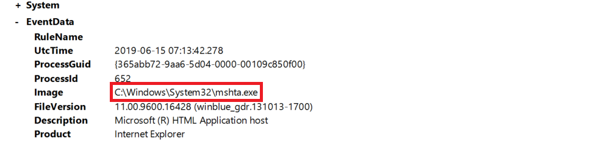
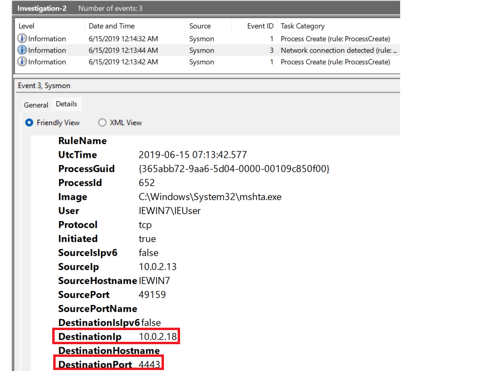
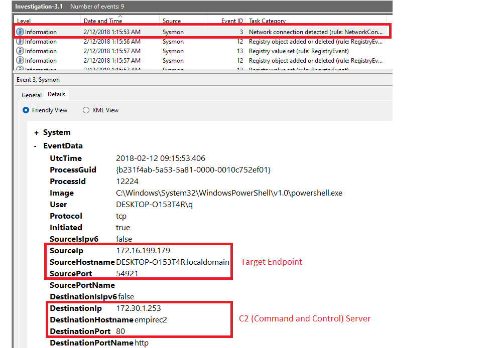
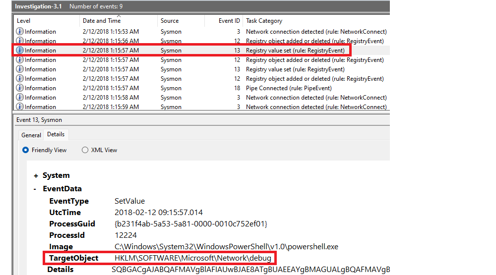
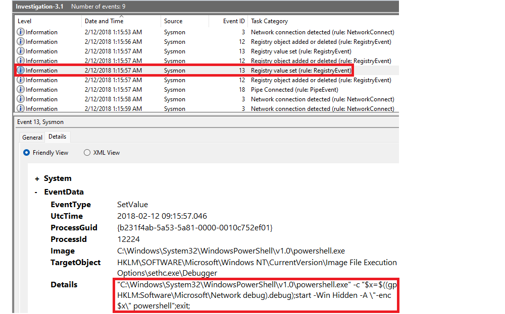

# Practical investigations

## ugh, BILL THAT'S THE WRONG USB!

In this investigation, your team has received reports that a malicious file was dropped onto a host by a malicious USB. 
They have pulled the logs suspected and have tasked you with running the investigation for it.

Logs are located in `C:\Users\THM-Analyst\Desktop\Scenarios\Investigations\Investigation-1.evtx`.

### Questions

**What is the full registry key of the USB device calling `svchost.exe`?**

In Event Viewer, look at the logs for the category called Registry value set (rule: registryEvent).

| 
|:--:|
| There are two entries for `EventID 13`. |

* The first one is for the `UWDFHost.exe`, which is used to communicate with hardware devices and to load drivers.
* The second entry is where the USB device calls the `svchost.exe`. The `TargetObject` value contains the full registry key.

With PowerShell:

    Get-WinEvent -Path <Path to evtx file> -FilterXPath '*/System/EventID=13 and */EventData/Data[@Name="Image"]="C:\Windows\system32\svchost.exe"' | FL

Answer: `HKLM\System\CurrentControlSet\Enum\WpdBusEnumRoot\UMB\2&37c186b&0&STORAGE#VOLUME`
`#_??_USBSTOR#DISK&VEN_SANDISK&PROD_U3_CRUZER_MICRO&REV_8.01#4054910EF19005B3&0#\FriendlyName`

**What is the device name when being called by RawAccessRead?**

In Event Viewer, look at `EventID 9` (RawAccessRead detected).

| 
|:--:|
| Task categories `RawAccessRead`. |

In Friendly View you can see the Device being called.

With PowerShell:

    Get-WinEvent -Path <Path to evtx file> -FilterXPath '*/System/EventID=9' | FL

Answer: `\Device\HarddiskVolume3`

**What is the first exe the process executes?**

Arrange entries in Event Viewer by Oldest to Latest events. `EventID 1` is the first process that `explorer.exe` 
creates, right after `EventID 9` for `RawAccessRead` of `explorer.exe`.
This shows it is `rundll32.exe` which is executed.

Answer: `rundll32.exe`

## This isn't an HTML file? 

Another suspicious file has appeared in your logs and has managed to execute code masking itself as an HTML file, 
evading your antivirus detections. Open the logs and investigate the suspicious file.  

Logs are located in `C:\Users\THM-Analyst\Desktop\Scenarios\Investigations\Investigation-2.evtx`.

### Questions

**What is the full path of the payload?**

| 
|:--:|
| The latest process created contains the full path under `CommandLine` (at the bottom). |

With PowerShell (view the `EventID 1` entries):

    Get-WinEvent -Path <Path to evtx file> -FilterXPath '*/System/EventID=1' | FL

Answer: `C:\Users\IEUser\AppData\Local\Microsoft\Windows\Temporary Internet Files\Content.IE5\S97WTYG7\update.hta`

**What is the full path of the file the payload masked itself as?**

Answer: `C:\Users\IEUser\Downloads\update.html`

**What signed binary executed the payload?**

| 
|:--:|
| [MITRE ATT&CK: System Binary Proxy Execution: Mshta](https://attack.mitre.org/techniques/T1218/005/): Adversaries may abuse `mshta.exe` to proxy  execution of malicious `.hta` files and Javascript or VBScript through a trusted Windows utility. |

With PowerShell:

    Get-WinEvent -Path C:\evtxfiles\Investigation-2.evtx -FilterXPath '*/System/EventID=1' | FL

Answer: `C:\Windows\System32\mshta.exe`

**What is the IP of the adversary?**

| 
|:--:|
| Look at the only other `EventID 3` (Network connection detected). Find the `Destination Port`. |

With PowerShell:

    Get-WinEvent -Path C:\evtxfiles\Investigation-2.evtx -FilterXPath '*/System/EventID=3' | FL

Answer: `10.0.2.18`

**What back connect port is used?**

Answer: `4443`

## Where's the bouncer when you need him

Your team has informed you that the adversary has managed to set up persistence on your endpoints as they continue 
to move throughout your network. Find how the adversary managed to gain persistence using logs provided.

Logs are located in `C:\Users\THM-Analyst\Desktop\Scenarios\Investigations\Investigation-3.1.evtx` 
and `C:\Users\THM-Analyst\Desktop\Scenarios\Investigations\Investigation-3.2.evtx`.

### Questions

**What is the IP of the suspected adversary?**

| 
|:--:|
| A C2 is a term commonly used as an abbreviation for Command-and-Control which is the endpoint that  an attacker uses to maintain communications, and send commands to a target system or  network that is compromised by malware. |

With PowerShell, filter by `EventID 3` (Network connection detected):

    Get-WinEvent -Path <Path to evtx file> -FilterXPath '*/System/EventID=3' | FL

Answer: `172.30.1.253`

**What is the hostname of the affected endpoint?**

Answer: `DESKTOP-O153T4R`

**What is the hostname of the C2 server connecting to the endpoint?**

Answer: `Empirec2`

**Where in the registry was the payload stored?**

| 
|:--:|
| Look for `EventID 13` (Registry value set) for the stored payload. |

With PowerShell:

    Get-WinEvent -Path C:\thmsysmon\Investigations\Investigation-3.1.evtx -FilterXPath '*/System/EventID=13' | FL

Answer: `HKLM\SOFTWARE\Microsoft\Network\debug`

**What PowerShell launch code was used to launch the payload?**

| 
|:--:|
| Second Event ID 13. |

With PowerShell:

    Get-WinEvent -Path C:\thmsysmon\Investigations\Investigation-3.1.evtx -FilterXPath '*/System/EventID=13' | FL

Answer: `"C:\Windows\System32\WindowsPowerShell\v1.0\powershell.exe" -c "$x=$((gp HKLM:Software\Microsoft\Network debug).debug);start -Win Hidden -A \"-enc $x\" powershell";exit;`

**What is the IP of the adversary?**

Answer: `172.168.103.188`

**What is the full path of the payload location?**

Answer: `c:\users\q\AppData:blah.txt`

**What was the full command used to create the scheduled task?**

In PowerShell, filter by `EventID` 1 and `Image`.

    Get-WinEvent -Path <Path to evtx file> -FilterXPath '*/System/EventID=1 and */EventData/Data[@Name="Image"]="C:\Windows\System32\schtasks.exe"' | FL

Answer: `"C:\WINDOWS\system32\schtasks.exe" /Create /F /SC DAILY /ST 09:00 /TN Updater /TR "C:\Windows\System32\WindowsPowerShell\v1.0\powershell.exe -NonI -W hidden -c \"IEX ([Text.Encoding]::UNICODE.GetString([Convert]::FromBase64String($(cmd /c "more < c:\users\q\AppData:blah.txt"’))))\""`

**What process was accessed by `schtasks.exe` that would be considered suspicious behaviour?**

PowerShell:

    Get-WinEvent -Path C:\thmsysmon\Investigations\Investigation-3.2.evtx -FilterXPath '*/System/EventID=10 and */EventData/Data[@Name="SourceImage"]="C:\WINDOWS\system32\lsass.exe"' | fl

Answer: `lsass.exe`

## Mom look! I built a botnet!

As the adversary has gained a solid foothold onto your network it has been brought to your attention that they may 
have been able to set up C2 communications on some endpoints. Collect the logs and continue your investigation.

Logs are located in `C:\Users\THM-Analyst\Desktop\Scenarios\Investigations\Investigation-4.evtx`.

### Questions

**What is the IP of the adversary?**

    Get-WinEvent -Path Investigation-4.evtx -FilterXPath '*/System/EventID=3' | FL

Answer: `172.30.1.253`

**What port is the adversary operating on?**

Answer: `80`

**What C2 is the adversary utilizing?**

Answer: `empire`
