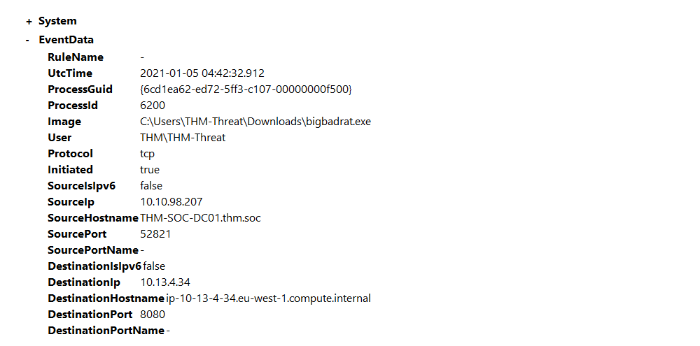

# Hunting malware

Malware has many forms and variations with different end goals. RATs or Remote Access Trojans are used similar to 
any other payload to gain remote access to a machine. RATs typically come with other antivirus and detection evasion 
techniques that make them different from other payloads like `msfvenom`. A RAT typically also uses a Client-Server 
model and comes with an interface for easy user administration. Examples of RATs are `Xeexe` and `Quasar`. 

To help detect and hunt malware, first identify the malware to hunt for or detect, and identify ways to modify 
configuration files (hypothesis-based hunting). There are a plethora of other ways to detect and log malware, 
but here only detecting open back connect ports is covered. 

## Rats and C2 Servers config

This is similar to [hunting Metasploit](metasploit.md). We can look through and create a configuration file to hunt 
and detect suspicious ports open on the endpoint.

The code snippet is from the Ion-Storm configuration file, and will alert on specific ports like 1034 and 1604 and 
exclude common network connections like OneDrive.

    <RuleGroup name="" groupRelation="or">
        <NetworkConnect onmatch="include">
            <DestinationPort condition="is">1034</DestinationPort>
            <DestinationPort condition="is">1604</DestinationPort>
        </NetworkConnect>
        <NetworkConnect onmatch="exclude">
            <Image condition="image">OneDrive.exe</Image>
        </NetworkConnect>
    </RuleGroup>

**Note: Attackers and adversaries have begun to use port 53 as part of their malware/payloads which would go undetected if 
you blindly used this configuration file as-is.**

## RAT being dropped on server

Open `C:\Users\THM-Analyst\Desktop\Scenarios\Practice\Hunting_Rats.evtx` in Event Viewer to view a live rat being 
dropped onto the server.

| 
|:--:|
| The event shows a custom RAT that operating on port 8080. |

## Hunting for common back connect ports with PowerShell

Filter on the `NetworkConnect` event ID and the `DestinationPort` data attribute.

    Get-WinEvent -Path <Path to Log> -FilterXPath '*/System/EventID=3 and */EventData/Data[@Name="DestinationPort"] and */EventData/Data=<Port>'

## Resources

* [MITRE ATT&CK Software](https://attack.mitre.org/software/)
