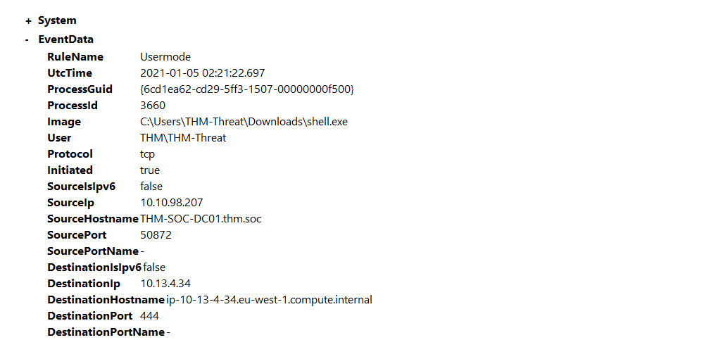

# Hunting metasploit

Metasploit is a commonly used exploit framework for penetration testing and red team operations. Metasploit can be 
used to easily run exploits on a machine and connect back to a meterpreter shell. To begin hunting for it, look for 
network connections that originate from suspicious ports such as 4444 and 5555. By default, Metasploit uses port 4444. 
If there is a connection to any IP known or unknown it should be investigated. To start an investigation, look at 
packet captures from the date of the log to begin looking for further information about the adversary. Also look for 
suspicious processes created. 

This method of hunting can be applied to other various RATs and C2 beacons.

## Network Connections config

Modify the Ion-Security configuration to detect the creation of new network connections. Use event `ID 3` along with 
the destination port to identify active connections specifically connections on port `4444` and `5555`. 

    <RuleGroup name="" groupRelation="or">
        <NetworkConnect onmatch="include">
            <DestinationPort condition="is">4444</DestinationPort>
            <DestinationPort condition="is">5555</DestinationPort>
        </NetworkConnect>
    </RuleGroup>

## Metasploit payload dropped

Open `C:\Users\THM-Analyst\Desktop\Scenarios\Practice\Hunting_Metasploit.evtx` in Event Viewer to view a basic 
Metasploit payload being dropped onto the machine.

| 
|:--:|
| Once we identify the event it can give us some important information we can use for  further investigation like the `ProcessID` and `Image`. |

## Hunting for Open Ports with PowerShell

Use the same `XPath` queries as used 
in the rule to filter out events from `NetworkConnect` with `DestinationPort`. 

    Get-WinEvent -Path <Path to Log> -FilterXPath '*/System/EventID=3 and */EventData/Data[@Name="DestinationPort"] and */EventData/Data=4444'

## Resources

* [ion-storm / sysmon-config](https://github.com/ion-storm/sysmon-config/blob/develop/sysmonconfig-export.xml)
* [Malware Common Ports Spreadsheet](https://docs.google.com/spreadsheets/d/17pSTDNpa0sf6pHeRhusvWG6rThciE8CsXTSlDUAZDyo/edit#gid=0)
