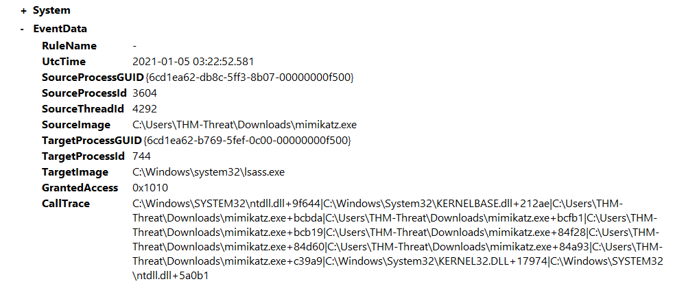

# Detecting mimikatz

Mimikatz is well known and commonly used to dump credentials from memory along with other Windows post-exploitation 
activity. Mimikatz is mainly known for dumping LSASS. We can hunt for the file created, execution of the file from 
an elevated process, creation of a remote thread, and processes that Mimikatz creates. Anti-Virus will typically 
pick up Mimikatz as the signature is very well known, but it is still possible for threat actors to obfuscate or 
use droppers to get the file onto the device.

## Mimikatz file creation config

The first method of hunting for `mimikatz` is just looking for files created with its name. This is a simple 
technique and can allow you to find anything that might have bypassed AV. Most of the time when dealing with an 
advanced threat more advanced hunting techniques like searching for LSASS behaviour are needed. 

    <RuleGroup name="" groupRelation="or">
        <FileCreate onmatch="include">
            <TargetFileName condition="contains">mimikatz</TargetFileName>
        </FileCreate>
    </RuleGroup>

## Abnormal LSASS behaviour config

We can use the ProcessAccess event ID to hunt for abnormal LSASS behavior. This would show potential LSASS abuse 
which usually connects back to `mimikatz` or some other kind of credential dumping tool. 

If LSASS is accessed by a process other than `svchost.exe` it should be considered suspicious behaviour and should 
be investigated further. To aid in looking for suspicious events, use a filter to only look for processes besides 
`svchost.exe`. Sysmon will provide further details to help lead the investigation such as the file path the process 
originated from. 

To aid in detections, use a custom configuration file:

    <RuleGroup name="" groupRelation="or">
        <ProcessAccess onmatch="include">
               <TargetImage condition="image">lsass.exe</TargetImage>
        </ProcessAccess>
    </RuleGroup>

## A basic exploit

Open `C:\Users\THM-Analyst\Desktop\Scenarios\Practice\Hunting_LSASS.evtx` in Event Viewer to view an attack using 
an obfuscated version of mimikatz to dump credentials from memory.

| 
|:--:|
| The event shows the mimikatz process accessed, and there are also a lot of  `svchost.exe` events. |

Alter the config to exclude events with the `SourceImage` event coming from `svhost.exe`:

    <RuleGroup name="" groupRelation="or">
        <ProcessAccess onmatch="exclude">
            <SourceImage condition="image">svchost.exe</SourceImage>
        </ProcessAccess>
        <ProcessAccess onmatch="include">
            <TargetImage condition="image">lsass.exe</TargetImage>
        </ProcessAccess>
    </RuleGroup>

## Detecting LSASS Behavior with PowerShell

Use the same `XPath` queries used in the rule to filter out the other processes from `TargetImage`. 

    Get-WinEvent -Path <Path to Log> -FilterXPath '*/System/EventID=10 and */EventData/Data[@Name="TargetImage"] and */EventData/Data="C:\Windows\system32\lsass.exe"'

## Resources

* [MITRE ATT&CK T1055](https://attack.mitre.org/techniques/T1055/)
* [MITRE ATT&CK S0002](https://attack.mitre.org/software/S0002/)
