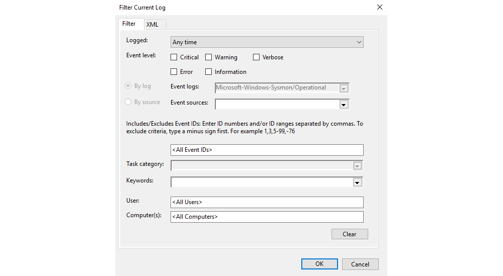
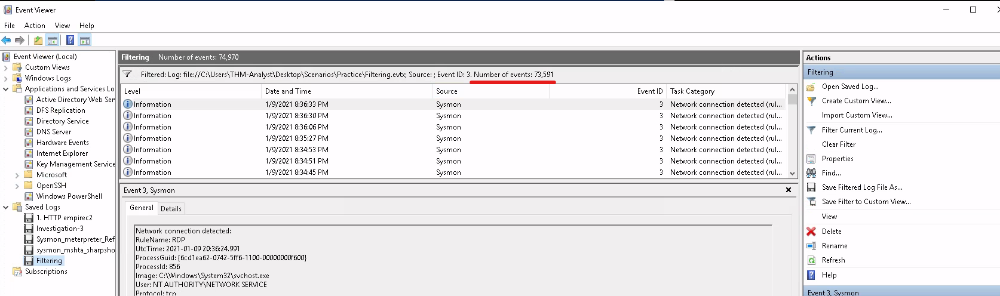

# Cutting out the noise

Since most of the normal activity or "noise" seen on a network is excluded or filtered out with Sysmon we are able 
to focus on meaningful events. This allows us to quickly identify and investigate suspicious activity. When 
actively monitoring a network you will want to use multiple detections and techniques simultaneously in an effort 
to identify threats.

## Best Practices

Sysmon offers a fairly open and configurable platform. There are a few best practices that can be implemented to 
ensure operating efficiently and not missing any potential threats. 

* Exclude > Include: When creating rules for the Sysmon configuration file, exclude events rather than include events. 
This prevents you from accidentally missing crucial events and only seeing the events that matter the most.
* CLI gives you further control: As is common with most applications the CLI gives you the most control and filtering, 
allowing for further granular control. You can use either `Get-WinEvent` or `wevutil.exe` to access and filter logs. 
When Sysmon is used with a SIEM or other detection solutions these tools will become less used and needed. 
* Knowing the environment is important when implementing any platform or tool. Have a firm understanding of the 
network or environment you are working within to fully understand what is normal and what is suspicious in order to 
effectively craft rules.

## Filtering events with Event Viewer

Event Viewer might not the best for filtering events and out-of-the-box offers limited control over logs. The main 
filter you will be using with Event Viewer is by EventID and keywords. You can also choose to filter by writing XML 
but this is a tedious process that does not scale well.

| 
|:--:|
| To open the filter menu select Filter Current Log from the Actions menu. |

## Filtering events with PowerShell

To view and filter events with PowerShell, use [Get-WinEvent](../wlogs/events.md) with 
[XPath queries](../wlogs/xpath.md). We can use any XPath queries that can be found in the XML view of events. 
We will be using `wevutil.exe` to view events once filtered. The command line is preferred over the Event Viewer GUI 
as it allows for further granular control and filtering.

Some basic filters:

* Filter by Event ID: `*/System/EventID=<ID>`
* Filter by XML Attribute/Name: `*/EventData/Data[@Name="<XML Attribute/Name>"]`
* Filter by Event Data: `*/EventData/Data=<Data>`

Putting these filters together with attributes and data will get the most control out of the logs. As an example of 
using `Get-WinEvent` to look for network connections coming from port 4444:

    Get-WinEvent -Path <Path to Log> -FilterXPath '*/System/EventID=3 and */EventData/Data[@Name="DestinationPort"] and */EventData/Data=4444'

### Questions

How many event ID 3 events are in `C:\Users\THM-Analyst\Desktop\Scenarios\Practice\Filtering.evtx`?

Open the `Filtering.evtx` file and in the Event Viewer App under Saved logs, click Filtering, and filter the current 
log by `ID 3`:

| 
|:--:|
| Answer: `73,591` |

What is the UTC time created of the first network event in `C:\Users\THM-Analyst\Desktop\Scenarios\Practice\Filtering.evtx`?

Scroll to the bottom of the list, click on the last row, in the middle bottom panel under General you will find the 
UTC time for the event.

Answer: `2021-01-06 01:35:50.464`
