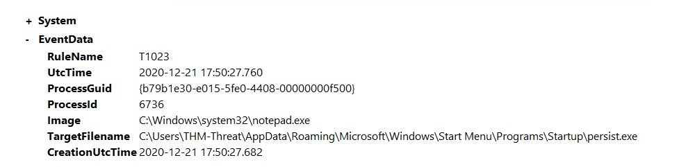

# Hunting persistence

Persistence is used by attackers to maintain access to a machine once it is compromised. There is a multitude of 
ways for an attacker to gain persistence on a machine. We will be focusing on registry modification as well as 
startup scripts. We can hunt persistence with Sysmon by looking for File Creation events as well as Registry 
Modification events.

## Startup persistence config

Use the SwiftOnSecurity detections for a file being placed in the `\Startup\` or `\Start Menu` directories.

    <RuleGroup name="" groupRelation="or">
        <FileCreate onmatch="include">
            <TargetFilename name="T1023" condition="contains">\Start Menu</TargetFilename>
            <TargetFilename name="T1165" condition="contains">\Startup\</TargetFilename>
        </FileCreate>
    </RuleGroup>

## Malicious EXE into the Startup folder

Open `C:\Users\THM-Analyst\Desktop\Scenarios\Practice\T1023.evtx` in Event Viewer to view a live attack on the 
machine that involves persistence by adding a malicious EXE into the Startup folder.

| 
|:--:|
| The event shows `persist.exe` placed in the Startup folder. |

Threat Actors will almost never make it this obvious but any changes to the Start Menu should be investigated. 
Adjust the configuration file to be more granular and create alerts past just the File Created tag. Another 
option is to filter by the Rule Name T1023.

Once suspicious binary or application has been identified, begin an investigation on the directory.

## Registry Key Persistence config

Another SwiftOnSecurity detection, now for a registry modification that adjusts for a script inside 
`CurrentVersion\Windows\Run` and other registry locations. 

    <RuleGroup name="" groupRelation="or">
        <RegistryEvent onmatch="include">
            <TargetObject name="T1060,RunKey" condition="contains">CurrentVersion\Run</TargetObject>
            <TargetObject name="T1484" condition="contains">Group Policy\Scripts</TargetObject>
            <TargetObject name="T1060" condition="contains">CurrentVersion\Windows\Run</TargetObject>
        </RegistryEvent>
    </RuleGroup>

## Modified registry

Open `C:\Users\THM-Analyst\Desktop\Scenarios\Practice\T1060.evtx` in Event Viewer to view an attack where the 
registry was modified to gain persistence.

| 
|:--:|
| The event shows the registry was modified and `malicious.exe` was added to  `HKLM\SOFTWARE\Microsoft\Windows\CurrentVersion\Run\Persistence`,  and that the exe can be found at `%windir%\System32\malicious.exe`. |

Filtering by the RuleName T1060 makes finding the anomaly easier.

If we wanted to investigate this anomaly we would need to look at the registry as well as the file location itself.

## Resources

* [MITRE ATT&CK T1547](https://attack.mitre.org/techniques/T1547/)
* [MITRE ATT&CK T1112](https://attack.mitre.org/techniques/T1112/)
