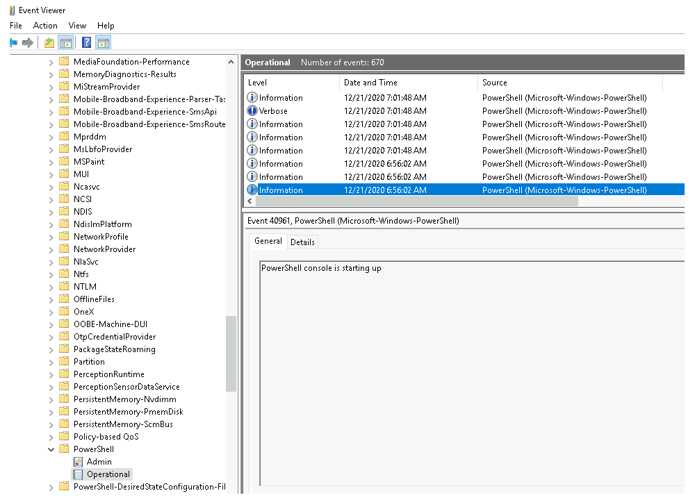
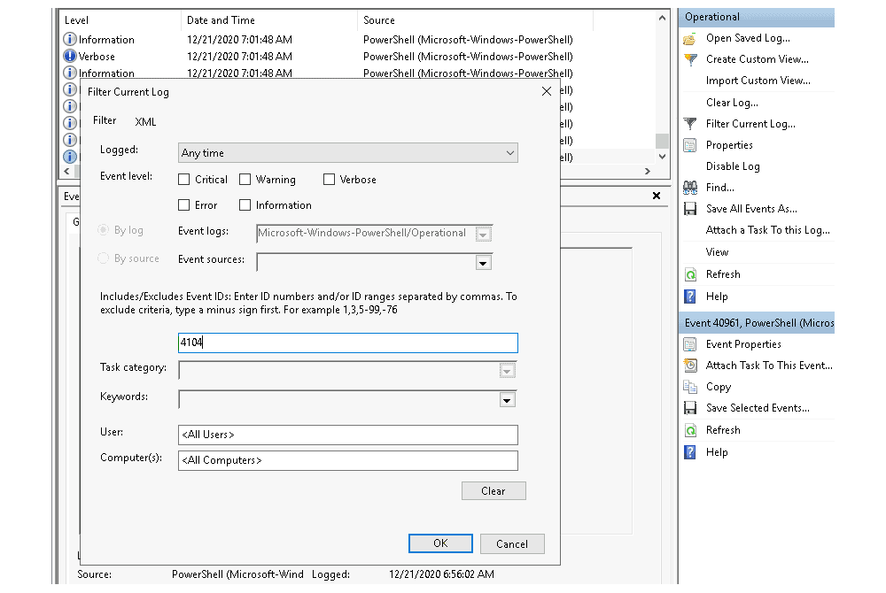
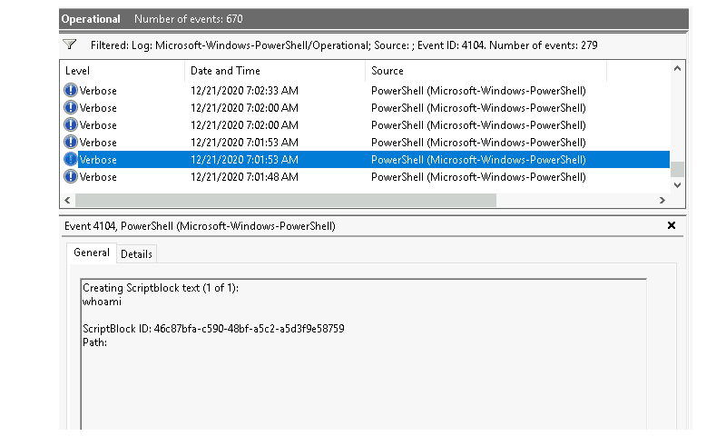
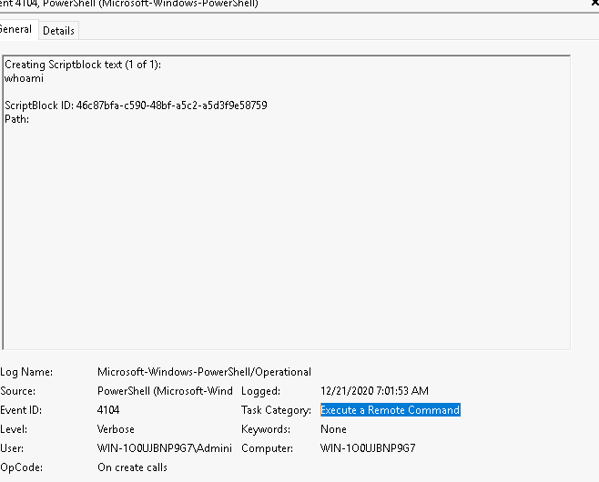

# Event logs

The Windows Event Logs are not text files that can be viewed using a text editor. The raw data can be translated into 
`XML` using the Windows API. The events in these log files are stored in a proprietary binary format with a `.evt` or 
`.evtx` extension. The log files with the `.evtx` file extension typically reside in `C:\Windows\System32\winevt\Logs`.

## Elements

* System Logs: Records events associated with the Operating System segments. They may include information about hardware changes, device drivers, system changes, and other activities related to the device.
* Security Logs: Records events connected to logon and logoff activities on a device. The system's audit policy specifies the events. The logs are an excellent source for analysts to investigate attempted or successful unauthorized activity.
* Application Logs: Records events related to applications installed on a system. The main pieces of information include application errors, events, and warnings.
* Directory Service Events: Active Directory changes and activities are recorded in these logs, mainly on domain controllers.
* File Replication Service Events:
* DNS Event Logs: DNS servers use these logs to record domain events and to map out
* Custom Logs: Events are logged by applications that require custom data storage. This allows applications to control the log size or attach other parameters, such as ACLs, for security purposes.

There are three main ways of accessing these event logs within a Windows system:

* Event Viewer (GUI-based application)
* Wevtutil.exe (command-line tool)
* Get-WinEvent (PowerShell cmdlet)

## Using the GUI method

1. Right-click on Start and select Event Viewer. 
2. Select the proper log: Applications and Services Logs -> Microsoft -> Windows -> Powershell -> Operational
3. What is the Event ID for the first event?

Scroll all the way down:

| 
|:--:|
| Answer: `40961` |

4. Filter on Event ID 4104. What was the 2nd command executed in the PowerShell session?

| 
|:--:|
| Filter on Event ID 4104 and scroll all the way down. |

| 
|:--:|
| Answer: `whoami` |

5. What is the Task Category for Event ID 4104?

| 
|:--:|
| Answer: `Execute a Remote Command` |

6. Analyse the Windows PowerShell log. What is the Task Category for Event ID 800?

On the left-hand side, navigate to Applications and Service Logs -> Windows PowerShell (standalone log). 
Clicking on the log entry to see the events listed with Event ID 800.

Answer: `Pipeline Execution Details`

## Using Wevtutil.exe

Per Microsoft, the wevtutil.exe tool "enables you to retrieve information about event logs and publishers. You can 
also use this command to install and uninstall event manifests, to run queries, and to export, archive, and clear logs."

1. How many log names are in the machine?

```text
PS C:\Users\Administrator> wevtutil.exe el | Measure-Object
```

Answer: `1071`

2. What event files would be read when using the query-events command?

```text
PS C:\Users\Administrator> wevtutil.exe qe /?
```

Answer: `event log,log file,structured query`.

3. What option would you use to provide a path to a log file?

Answer: `/lf:true`

4. What is the VALUE for `/q`?

Answer: `XPATH query`

The questions below are based on this command: `wevtutil qe Application /c:3 /rd:true /f:text`

5. What is the log name?

```text
PS C:\Users\Administrator> wevtutil qe Application /c:3 /rd:true /f:text
```

Answer: `Application`

6. What is the `/rd` option for?

Answer: `Event read direction`

7. What is the `/c` option for?

Answer: `Maximum number of events to read`


## Using Get-WinEvent