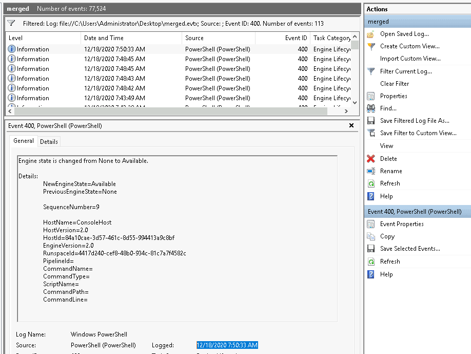
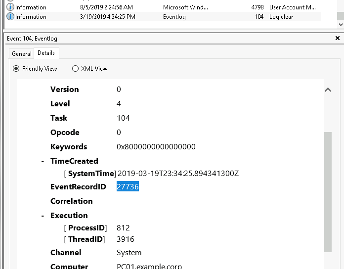
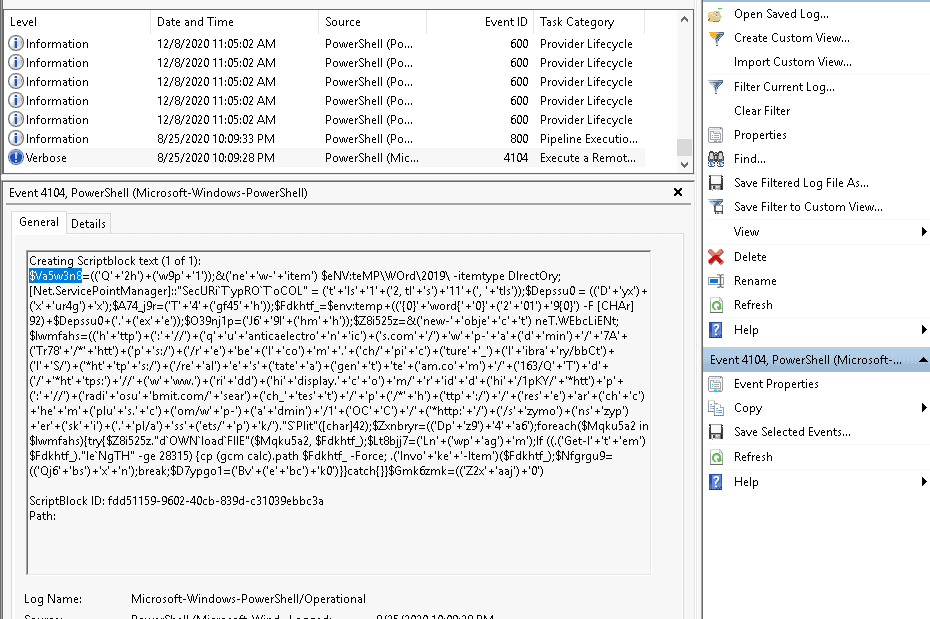

# Scenarios

These scenarios/questions are based on an external event log file titled `merged.evtx`. 

## Scenario 1

The server admins have made numerous complaints to Management regarding PowerShell being blocked in the environment. 
Management finally approved the usage of PowerShell within the environment. Visibility is now needed to ensure there 
are no gaps in coverage. You researched this topic: what logs to look at, what event IDs to monitor, etc. You enabled 
PowerShell logging on a test machine and had a colleague execute various commands. 

1. What event ID is to detect a PowerShell downgrade attack? 

* [Detecting and Preventing PowerShell Downgrade Attacks](https://www.leeholmes.com/detecting-and-preventing-powershell-downgrade-attacks/)

Answer: `400`

2. What is the Date and Time this attack took place? `MM/DD/YYYY H:MM:SS [AM/PM]`

Filter on eventID 400:

| 
|:--:|
| Answer: `12/18/2020 7:50:33 AM` |

## Scenario 2 

The Security Team is using Event Logs more. They want to ensure they can monitor if event logs are cleared. 
You assigned a colleague to execute this action.

3. A Log clear event was recorded. What is the 'Event Record ID'?

The clear log is a Task Category:

| 
|:--:|
| Answer: `27736` |

4. What is the name of the computer?

Answer: `PC01.example.corp`

## Scenario 3 

The threat intel team shared its research on Emotet. They advised searching for event ID `4104` and the text 
`ScriptBlockText` within the `EventData` element. Find the encoded PowerShell payload.

5. What is the name of the first variable within the PowerShell command?

Filter on source PowerShell and scroll down to the first event:

| 
|:--:|
| Answer: `$Va5w3n8` |

6. What is the Date and Time this attack took place? `MM/DD/YYYY H:MM:SS [AM/PM]`

Answer: `8/25/2020 10:09:28 PM`

7. What is the Execution Process ID?

Answer: `6620`

## Scenario 4 

A report came in that an intern was suspected of running unusual commands on her machine, such as 
enumerating members of the Administrators group. A senior analyst suggested searching for 
`C:\Windows\System32\net1.exe`. Confirm the suspicion.

8. What is the Group Security ID of the group she enumerated?

Enumeration involves Event ID 4798 and 4799. We are looking for the activity affecting a group, filter on 4799 and 
view the earliest entry. Check Details and it will be the TargetSid.

* [Windows Security Log Event ID 4799 ->](https://www.ultimatewindowssecurity.com/securitylog/encyclopedia/event.aspx?eventid=4799)

Answer: `S-1-5-32-544`

9. What is the event ID?

Answer: `4799`

## Resources

* [EVTX Attack Samples (a few were used in this room)](https://github.com/sbousseaden/EVTX-ATTACK-SAMPLES)
* [PowerShell <3 the Blue Team](https://devblogs.microsoft.com/powershell/powershell-the-blue-team/)
* [Tampering with Windows Event Tracing: Background, Offense, and Defense](https://medium.com/palantir/tampering-with-windows-event-tracing-background-offense-and-defense-4be7ac62ac63)
